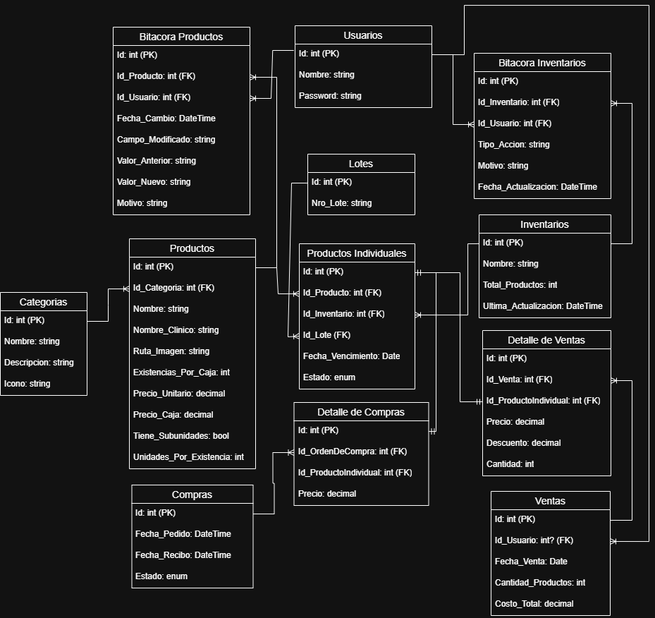

# Documentación del Proyecto - Sistema de Inventario Farmacéutico

## Resumen Ejecutivo

> **Objetivo Principal:** Desarrollar un sistema integral de gestión de inventario farmacéutico que optimice los procesos operativos y mejore el control de existencias mediante la automatización y digitalización de procesos.

Este documento proporciona una guía completa sobre el proyecto de inventario farmacéutico, incluyendo su propósito, análisis de requerimientos, arquitectura técnica y metodología de desarrollo, complementándose con los conocimientos adquiridos durante el transcurso de los cursos de la carrera.

## Propósito del Proyecto

El presente proyecto tiene como **objetivo principal** desarrollar un sistema de gestión de inventario para la tienda farmacéutica **Farmacias Blanco**, el cual permita llevar un control eficiente de los productos farmacéuticos, automatizando el control de existencias, optimizando los procesos de compra y venta, y mejorando la trazabilidad de las entradas y salidas de productos.

### Beneficios Esperados

Los beneficios clave que se esperan obtener con la implementación del sistema incluyen:

- **Automatización** de procesos manuales repetitivos
- **Reducción significativa** de errores humanos en el manejo de inventario
- **Optimización** del tiempo de gestión y operaciones diarias
- **Mejora** en el control de fechas de caducidad y vencimientos
- **Incremento** en la eficiencia operativa general
- **Trazabilidad completa** de productos y movimientos entre inventarios
- **Generación automática** de reportes y estadísticas

## Análisis de Requerimientos

El análisis de requerimientos se centra en identificar las necesidades del usuario y los requisitos funcionales y no funcionales del sistema. Estos son extraídos a través de una entrevista directa con el cliente y análisis de procesos actuales.

### Requerimientos Funcionales Principales

#### RF-01. Gestión de Inventarios

**Capacidad para controlar múltiples inventarios:**

- **RF-01.1 Inventario Local**: Manejo en farmacia para venta directa al público
- **RF-01.2 Inventario Externo**: Almacenamiento de stock en reserva
- **RF-01.3 Transferencias entre Inventarios**: Transferencias y movimientos (altas y bajas) entre inventarios, permitiendo una gestión más ágil y eficiente, además de llevar un registro detallado de cada movimiento.
- **RF-01.4 Sincronización Automática**: Sincronización automática de datos entre inventarios, garantizando que la información esté siempre actualizada y disponible en tiempo real.

#### RF-02. Gestión de Productos

**Control completo del catálogo de productos:**

- **RF-02.1 Crear Productos**: Posibilidad de añadir nuevos productos con información completa y al detalle
- **RF-02.2 Editar Productos**: Posibilidad de editar información de productos existentes
- **RF-02.3 Eliminar Productos**: Posibilidad de eliminar productos del registro según desee el usuario
- **RF-02.4 Categorización de Productos**: Permitir un mejor orden, agregando categorización y clasificación de productos

#### RF-03. Actualización Automática de Precios

**Sistema inteligente de gestión de precios:**

- **RF-03.1 Actualización por Compras**: Realizar actualización automática de precios al realizar compras de productos aplicando una media ponderada
- **RF-03.2 Historial de Precios**: Contar con un historial de cambios de precios realizados en cada producto

#### RF-04. Gestión de Productos Individuales

**Control granular de cada unidad:**

- **RF-04.1 Control por Lote y Caducidad**: Gestión individual de cada existencia de producto, incluyendo su estado, número de lote y fechas de caducidad
- **RF-04.2 Control de Ubicación**: Control de ubicación de cada existencia de producto entre los dos inventarios

#### RF-05. Control de Stock y Alertas

**Monitoreo inteligente de inventario:**

- **RF-05.1 Monitoreo Continuo**: Monitoreo continuo de niveles de stock de cada producto
- **RF-05.2 Alertas de Reabastecimiento**: Alertas automáticas para reabastecimiento en caso de stock bajo
- **RF-05.3 Alertas de Caducidad**: Notificaciones de productos próximos a caducar
- **RF-05.4 Metodología FIFO**: Implementación de metodología `FIFO` (First In, First Out) junto a la gestión de fechas de caducidad de los productos para el orden de salidas y la realización de ventas

#### RF-06. Sistema de Búsqueda y Filtrado

**Acceso eficiente a la información:**

- **RF-06.1 Filtros por Categoría**: Filtros de búsqueda por categorías de productos
- **RF-06.2 Búsqueda por Nombre/Código**: Búsqueda por nombre y/o código de productos y categorías
- **RF-06.3 Filtros Avanzados**: Filtros avanzados por fecha, precio, stock y estado, en productos individuales

#### RF-07. Gestión de Compras y Ventas

**Automatización de transacciones comerciales:**

- **RF-07.1 Registro de Compras**: Registro automático de compras (altas) de productos
- **RF-07.2 Registro de Ventas**: Registro automático de ventas (bajas) de productos
- **RF-07.3 Actualización Automática**: Actualización instantánea de inventarios al registrar movimientos
- **RF-07.4 Historial de Transacciones**: Historial completo de transacciones realizadas, con datos relevantes como fecha, producto, cantidad y usuario
- **RF-07.5 Integración Facturación**: Integración con sistemas de facturación (planificada para futuro)

#### RF-08. Reportes y Estadísticas

**Inteligencia de negocio integrada:**

- **RF-08.1 Bitácora de Productos**: Bitácora completa de operaciones por producto, tomando en cuenta adición, edición y eliminación
- **RF-08.2 Bitácora de Inventarios**: Bitácora de movimientos por inventario, tomando en cuenta transferencias entre secciones, así como altas y bajas de productos
- **RF-08.3 Informes Automáticos**: Generación automática de informes de operaciones periódicas o a decisión del usuario
- **RF-08.4 Estadísticas de Ventas**: Estadísticas de ventas y rotación de productos

#### RF-09. Gestión de Usuarios y Seguridad

**Control de acceso y auditoria:**

- **RF-09.1 Perfiles de Usuario**: Creación y gestión de perfiles de usuario
- **RF-09.2 Registro de Operaciones**: Registro de usuarios en todas las operaciones
- **RF-09.3 Trazabilidad de Acciones**: Trazabilidad completa de acciones

#### RF-10. Interfaz de Usuario

**Experiencia de usuario optimizada:**

- **RF-10.1 Diseño Intuitivo**: Diseño intuitivo y amigable
- **RF-10.2 Navegación Simplificada**: Navegación simplificada
- **RF-10.3 Accesibilidad**: Accesibilidad y usabilidad mejorada

## Matriz de Requerimientos Funcionales

### Enumeración de Requerimientos

| ID          | Requerimiento                             | Categoría         | Prioridad  |
| :---------- | :---------------------------------------- | :---------------- | :--------- |
| **RF-01**   | **_Gestión de Inventarios_**              | Core              | Alta       |
| **RF-01.1** | Inventario Local                          | Gestión           | Alta       |
| **RF-01.2** | Inventario Externo                        | Gestión           | Alta       |
| **RF-01.3** | Transferencias entre Inventarios          | Operaciones       | Alta       |
| **RF-01.4** | Sincronización Automática                 | Sistema           | Alta       |
| **RF-02**   | **_Gestión de Productos_**                | Core              | Alta       |
| **RF-02.1** | Crear Productos                           | CRUD              | Alta       |
| **RF-02.2** | Editar Productos                          | CRUD              | Alta       |
| **RF-02.3** | Eliminar Productos                        | CRUD              | Media      |
| **RF-02.4** | Categorización de Productos               | Organización      | Media      |
| **RF-03**   | **_Actualización Automática de Precios_** | Automatización    | Alta       |
| **RF-03.1** | Actualización por Compras                 | Automatización    | Alta       |
| **RF-03.2** | Historial de Precios                      | Auditoría         | Media      |
| **RF-04**   | **_Gestión de Productos Individuales_**   | Control           | Alta       |
| **RF-04.1** | Control por Lote y Caducidad              | Trazabilidad      | Alta       |
| **RF-04.2** | Control de Ubicación                      | Logística         | Alta       |
| **RF-05**   | **_Control de Stock y Alertas_**          | Monitoreo         | Alta       |
| **RF-05.1** | Monitoreo Continuo                        | Sistema           | Alta       |
| **RF-05.2** | Alertas de Reabastecimiento               | Notificaciones    | Alta       |
| **RF-05.3** | Alertas de Caducidad                      | Notificaciones    | Alta       |
| **RF-05.4** | Metodología FIFO                          | Lógica de Negocio | Alta       |
| **RF-06**   | **_Sistema de Búsqueda y Filtrado_**      | Interface         | Media      |
| **RF-06.1** | Filtros por Categoría                     | Búsqueda          | Media      |
| **RF-06.2** | Búsqueda por Nombre/Código                | Búsqueda          | Media      |
| **RF-06.3** | Filtros Avanzados                         | Búsqueda          | Baja       |
| **RF-07**   | **_Gestión de Compras y Ventas_**         | Transacciones     | Alta       |
| **RF-07.1** | Registro de Compras                       | Operaciones       | Alta       |
| **RF-07.2** | Registro de Ventas                        | Operaciones       | Alta       |
| **RF-07.3** | Actualización automática de precios       | Sistema           | Alta       |
| **RF-07.4** | Historial de Transacciones                | Auditoría         | Media      |
| **RF-07.5** | Integración Facturación                   | Futuro            | Baja       |
| **RF-08**   | **_Reportes y Estadísticas_**             | Analítica         | Media      |
| **RF-08.1** | Bitácora de Productos                     | Auditoría         | Media      |
| **RF-08.2** | Bitácora de Inventarios                   | Auditoría         | Media      |
| **RF-08.3** | Informes Automáticos                      | Reportes          | Media      |
| **RF-08.4** | Estadísticas de Ventas                    | Analítica         | Baja       |
| **RF-09**   | **_Gestión de Usuarios y Seguridad_**     | Seguridad         | Media-Baja |
| **RF-09.1** | Perfiles de Usuario                       | Autenticación     | Media      |
| **RF-09.2** | Registro de Operaciones                   | Auditoría         | Baja       |
| **RF-09.3** | Trazabilidad de Acciones                  | Auditoría         | Media      |
| **RF-10**   | **_Interfaz de Usuario_**                 | UX/UI             | Alta       |
| **RF-10.1** | Diseño Intuitivo                          | Interfaz          | Alta       |
| **RF-10.2** | Navegación Simplificada                   | Interfaz          | Alta       |
| **RF-10.3** | Accesibilidad                             | Interfaz          | Media      |

## Stack Tecnológico

Para el desarrollo del sistema de gestión de inventario, se han seleccionado cuidadosamente las siguientes tecnologías, basándose en criterios de escalabilidad, rendimiento, mantenibilidad y conocimientos adquiridos:

### Base de Datos

**`SQLite`** - Sistema de gestión de base de datos

- Almacenamiento ligero y eficiente de datos
- Capacidad de crear backups rápidos (archivo local)
- Ideal para aplicaciones de tamaño medio
- Sin necesidad de servidor de base de datos dedicado

### Backend

**`.NET Core Minimal APIs`** - Framework de desarrollo

- Creación de API RESTful robusta y escalable
- Aprovechamiento de conocimientos de la carrera (en el lenguaje C#)
- Facilidad de uso y desarrollo ágil
- Excelente rendimiento y escalabilidad
- Amplio soporte de la comunidad

### Frontend

**`Blazor Pages (WebAssembly + Server)`** - Framework de interfaz de usuario

- Interfaz dinámica y responsiva
- Manejo eficiente de estados globales
- Componentes reutilizables y modulares
- Desarrollo en C# end-to-end
- Aprovechamiento de conocimientos de la carrera (en el lenguaje C#)
- Integración fluida con backend .NET

### Control de Versiones y Colaboración

**`Git`** y **`GitHub`** - Gestión de código fuente

- Seguimiento completo del desarrollo
- Historial de cambios detallado
- Versionado robusto y auditable

### Herramientas de Desarrollo y Distribución

**`.NET Single File Deployment`** - Empaquetado de aplicación

- Generación de ejecutable único auto-contenido
- Distribución simplificada sin dependencias externas
- Compatibilidad con Windows, Linux y macOS
- Integración nativa del backend y frontend en un solo archivo

**`Inno Setup`** - Creación de instaladores

- Generación de instaladores profesionales para Windows
- Configuración de rutas de instalación y shortcuts
- Desinstalación limpia del sistema
- Personalización completa del proceso de instalación

**`Visual Studio Code`** - Entorno de desarrollo integrado

- Ligero y altamente extensible con herramientas dedicadas al lenguaje C#
- Integración visual con Git y GitHub
- IntelliSense para todo el stack tecnológico

### Documentación y Colaboración

**`Markdown`** con **`CrossNote`** - Documentación técnica

- Documentación técnica estructurada y versionada
- Estilos personalizados para presentación profesional
- Integración con control de versiones
- Exportación a múltiples formatos

**`Excalidraw`** - Diagramas de arquitectura

- Modelado de arquitectura del sistema
- Diagramas de flujo de procesos
- Documentación visual de la base de datos
- Esquemas de despliegue y infraestructura

### Documentación de API

**`Swagger/OpenAPI`** - Documentación interactiva

- Documentación automática de endpoints
- Interfaz de pruebas integrada
- Estándares de la industria
- Facilita la integración y mantenimiento

## Arquitectura del Sistema

> **Patrón Arquitectónico:** El sistema implementa una arquitectura de capas con separación clara de responsabilidades, siguiendo principios SOLID y buenas prácticas de desarrollo.

### Componentes Principales

1. **Capa de Presentación** - Blazor Server Pages
2. **Capa de API** - .NET Core Minimal APIs
3. **Capa de Lógica de Negocio** - Servicios y reglas de negocio
4. **Capa de Acceso a Datos** - Entity Framework Core con SQLite
5. **Capa de Seguridad** - Autenticación y autorización

### Flujo de Datos

```
Usuario → Blazor UI → API .NET → Lógica de Negocio → Acceso a datos → SQLite
```

### Diagrama de flujo de datos y comunicación


### Modelo de Base de Datos

> **Diseño de Entidades:** El sistema utiliza SQLite como motor de base de datos con Entity Framework Core para el mapeo objeto-relacional.



#### Entidades principales de modelo

1. **Usuarios:** Representa a un usuario del sistema, con información personal y de acceso, vital para la trazabilidad en bitácoras.
2. **Categorias:** Representa la clasificación de los productos en el sistema, facilitando la organización y búsqueda.
3. **Productos:** Representa un producto en el sistema, con detalles relevantes para la gestión de stock y ventas.
4. **Productos Individuales:** Representa una existencia de un producto específico, con información detallada sobre su estado, ubicación y fecha de vencimiento.
5. **Lotes:** Representa un grupo de productos individuales que comparten un mismo lote de fabricación.
6. **Inventarios:** Local o Externo, representa la locación de los productos individuales.
7. **Ventas:** Representa todas las salidas por venta de los productos, con detalles relevantes como el usuario que realizó la venta y la fecha de la transacción.
8. **Detalle de Ventas:** Representa los productos específicos incluidos en una venta, con información sobre cantidades y precios.
9. **Compras:** Representa un pedido realizado por un usuario, incluyendo información sobre los productos solicitados y su estado.
10. **Detalle de Compras:** Representa los productos específicos incluidos en una compra, con información sobre cantidades y precios.
11. **Bitacora Inventario:** Registra los movimientos y cambios en el inventario, incluyendo entradas y salidas de productos.
12. **Bitacora Productos:** Registra cambios en la información de los productos, como actualizaciones de precios o descripciones.

## Metodología de Desarrollo

El proyecto sigue una metodología ágil con las siguientes características:

- **Desarrollo iterativo** con sprints cortos
- **Integración continua** mediante Git y GitHub
- **Documentación continua** del código y APIs
- **Proceso iterativo** de desarrollo de módulos y retroalimentación

## Proceso de Distribución

> **Distribución como Aplicación Nativa:** El sistema se distribuye como una aplicación de escritorio auto-contenida que incluye tanto el backend como el frontend en un solo ejecutable.

**Flujo de Distribución:**

1. **Desarrollo** → Código fuente en repositorio Git
2. **Build Automatizado** → .NET genera el ejecutable haciendo uso de un proyecto orquestador
3. **Packaging** → Inno Setup crea el instalador
4. **Distribución** → Instalador listo para cliente final
5. **Instalación** → Cliente instala el paquete como aplicación nativa
6. **Ejecución** → Se inicia el backend, se le proporciona un tiempo de carga y se abre el frontend en el navegador

## Tabla de Seguimiento de Desarrollo

| ID          | Requerimiento                             | Estado      |  Fase  | Notas                                                                 |
| :---------- | :---------------------------------------- | :---------- | :----: | --------------------------------------------------------------------- |
| **RF-01**   | **_Gestión de Inventarios_**              | En Progreso | Fase 1 | Estructura base implementada                                          |
| **RF-01.1** | Inventario Local                          | Pendiente   | Fase 1 | -                                                                     |
| **RF-01.2** | Inventario Externo                        | Pendiente   | Fase 1 | -                                                                     |
| **RF-01.3** | Transferencias entre Inventarios          | Pendiente   | Fase 1 | -                                                                     |
| **RF-01.4** | Sincronización Automática                 | Bloqueado   | Fase 2 | Dependiente de RF-01.3                                                |
| **RF-02**   | **_Gestión de Productos_**                | Completado  | Fase 1 | CRUD básico implementado                                              |
| **RF-02.1** | Crear Productos                           | Completado  | Fase 1 | Funcional                                                             |
| **RF-02.2** | Editar Productos                          | Completado  | Fase 1 | Funcional                                                             |
| **RF-02.3** | Eliminar Productos                        | Completado  | Fase 1 | Funcional                                                             |
| **RF-02.4** | Categorización de Productos               | Completado  | Fase 1 | Analizar eliminación en restringida o en cascada                      |
| **RF-03**   | **_Actualización Automática de Precios_** | Pendiente   | Fase 2 | Planificado                                                           |
| **RF-03.1** | Actualización por Compras                 | Pendiente   | Fase 2 | -                                                                     |
| **RF-03.2** | Historial de Precios                      | Pendiente   | Fase 2 | -                                                                     |
| **RF-04**   | **_Gestión de Productos Individuales_**   | Bloqueado   | Fase 1 | Dependiente de RF-07.1                                                |
| **RF-04.1** | Control por Lote y Caducidad              | Pendiente   | Fase 1 | -                                                                     |
| **RF-04.2** | Control de Ubicación                      | Pendiente   | Fase 1 | -                                                                     |
| **RF-05**   | **_Control de Stock y Alertas_**          | Pendiente   | Fase 2 | -                                                                     |
| **RF-05.1** | Monitoreo Continuo                        | Pendiente   | Fase 2 | -                                                                     |
| **RF-05.2** | Alertas de Reabastecimiento               | Pendiente   | Fase 2 | Constantes a utilizar ya creadas en capa de dominio                   |
| **RF-05.3** | Alertas de Caducidad                      | Pendiente   | Fase 2 | Rango de fecha ya establecido en backend (1 mes)                      |
| **RF-05.4** | Metodología FIFO                          | Pendiente   | Fase 2 | -                                                                     |
| **RF-06**   | **_Sistema de Búsqueda y Filtrado_**      | Pendiente   | Fase 2 | Baja prioridad                                                        |
| **RF-06.1** | Filtros por Categoría                     | Completado  | Fase 2 | -                                                                     |
| **RF-06.2** | Búsqueda por Nombre/Código                | En Progreso | Fase 2 | Implementado en categorías y productos, pendiente inventarios         |
| **RF-06.3** | Filtros Avanzados                         | Pendiente   | Fase 3 | -                                                                     |
| **RF-07**   | **_Gestión de Compras y Ventas_**         | En Progreso | Fase 1 | Planeada                                                              |
| **RF-07.1** | Registro de Compras                       | En Progreso | Fase 1 | Desarrollo en curso                                                   |
| **RF-07.2** | Registro de Ventas                        | Pendiente   | Fase 1 | -                                                                     |
| **RF-07.3** | Actualización Automática                  | Bloqueado   | Fase 1 | Dependiente de RF-07.1                                                |
| **RF-07.4** | Historial de Transacciones                | Pendiente   | Fase 2 | Dependiente de RF-07.2                                                |
| **RF-07.5** | Integración Facturación                   | Pendiente   | Futuro | No prioritario                                                        |
| **RF-08**   | **_Reportes y Estadísticas_**             | Pendiente   | Fase 3 | Baja prioridad                                                        |
| **RF-08.1** | Bitácora de Productos                     | Pendiente   | Fase 3 | -                                                                     |
| **RF-08.2** | Bitácora de Inventarios                   | Pendiente   | Fase 3 | -                                                                     |
| **RF-08.3** | Informes Automáticos                      | Pendiente   | Fase 3 | -                                                                     |
| **RF-08.4** | Estadísticas de Ventas                    | Pendiente   | Fase 3 | -                                                                     |
| **RF-09**   | **_Gestión de Usuarios y Seguridad_**     | Pendiente   | Fase 3 | No tan urgente al ser un negocio familiar (solicitado por el cliente) |
| **RF-09.1** | Perfiles de Usuario                       | Pendiente   | Fase 3 | -                                                                     |
| **RF-09.2** | Registro de Operaciones                   | Pendiente   | Fase 3 | -                                                                     |
| **RF-09.3** | Trazabilidad de Acciones                  | Pendiente   | Fase 3 | -                                                                     |
| **RF-10**   | **_Interfaz de Usuario_**                 | En Progreso | Fase 1 | Mejoras iterativas                                                    |
| **RF-10.1** | Diseño Intuitivo                          | En Progreso | Fase 1 | En desarrollo                                                         |
| **RF-10.2** | Navegación Simplificada                   | En Progreso | Fase 1 | En desarrollo                                                         |
| **RF-10.3** | Accesibilidad                             | Pendiente   | Fase 3 | -                                                                     |

### Leyenda de Estados

- **Completado**: Funcionalidad desarrollada, implementada y probada
- **En Progreso**: Actualmente en desarrollo
- **Pendiente**: Planificado pero no iniciado
- **Bloqueado**: Impedimento o dependencia no resuelta
- **En Revisión**: Completado, pendiente de validación

### Resumen por Fases

| Fase       | Requerimientos | Completados | En Progreso | Pendientes | Bloqueados | % Avance |
| :--------- | :------------- | :---------: | :---------: | :--------: | :--------: | :------: |
| **Fase 1** | 14             |      4      |      3      |     6      |     1      | **~30%** |
| **Fase 2** | 10             |      1      |      1      |     7      |     1      | **10%**  |
| **Fase 3** | 9              |      0      |      0      |     9      |     0      |  **0%**  |
| **Futuro** | 1              |      0      |      0      |     1      |     0      |  **0%**  |
| **Total**  | **34**         |    **5**    |    **4**    |   **23**   |   **2**    | **~40%** |

**Fecha de última actualización:** 31 de Agosto de 2025  
**Versión del documento:** 0.4  
**Estado del proyecto:** En desarrollo activo

---
