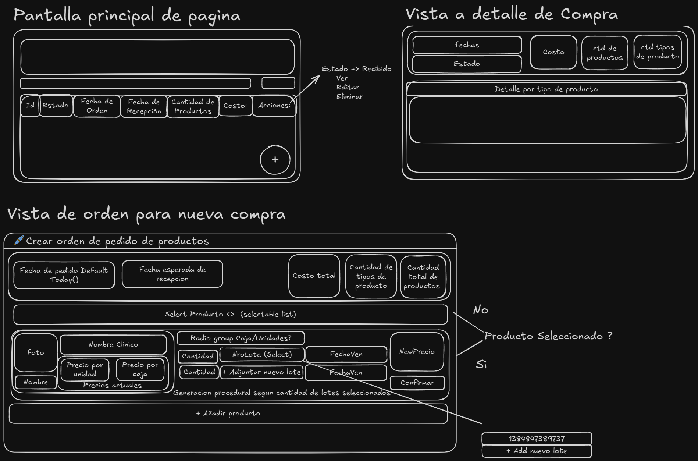
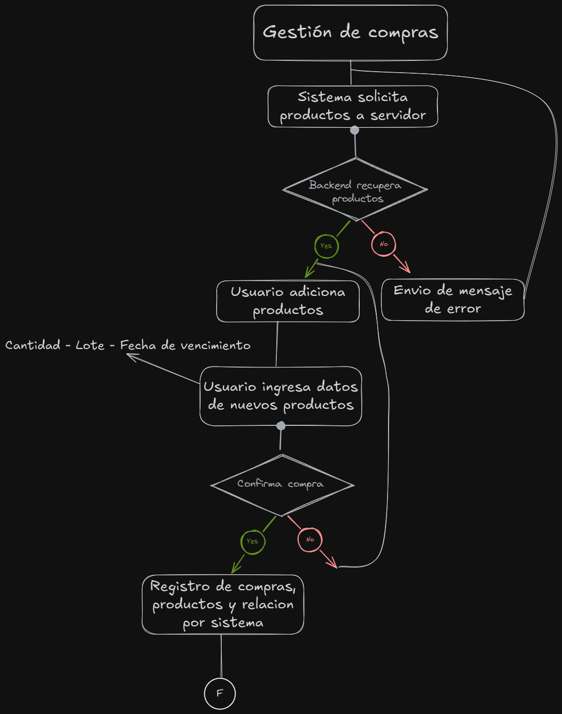

## RF-07.1 Registro de Compras (Altas de productos)

### Historia de Usuario

**_Como_** usuario del sistema
**_Quiero_** tener un registro para nuevas compras donde establecer la fecha de pedido, la fecha esperada de recepcion.
Ademas de tener la posiblidad de seleccionar varios tipos de producto para ordenar, pudiendo escoger si quiero comprar por cajas o por unidades. Recibo varios productos que pueden tener o no el mismo numero de lote asi que quiero poder adjuntar diferentes lotes para mi producto o crear nuevos en caso de ser necesario,6 y a su vez adjutar las fechas de vencimiento para cada lote de productos.
Finalmente quiero agregar el precio al cual estoy comprando estos productos el cual sera una media ponderada entre el precio viejo y el precio nuevo
**_Para_** gestionar las compras de productos y mantener un inventario actualizado.

### Tareas

#### Shared

- [x] Crear DTO para almacenar una nueva orden de compra
- [x] Crear DTO para recuperar la informacion de un tipo de producto
- [x] Crear DTO para recuperar los lotes disponibles de un tipo de producto o agregar uno nuevo
- [x] Crear DTO para crear un producto individual

#### Frontend

- [x] Crear vista para insertar datos de nueva compra, y datos variables segun los productos a adicionarse
- [x] Crear campo para seleccionar multiples productos a comprar
- [x] Crear campo para adicionar lotes a la compra y en caso de no existir, crear uno nuevo
- [x] Mostrar el recuento de tipos de producto a comprar
- [x] Crear campo para adicionar fechas de vencimiento a los lotes en caso de ser nuevos
- [x] Crear campo para adicionar el precio de compra de un nuevo producto
- [x] Mostrar recuento de cantidad de productos a comprar en total
- [x] Mostrar recuento total de precio de la compra
- [x] Crear boton para guardar la nueva orden de compra

#### Backend

- [x] Crear servicio de recuperacion de productos para seccion de compras y respectivo endpoint
- [x] Crear servicio de recuperacion de lotes para seccion de compras y respectivo endpoint
- [x] Crear servicio de creacion de productos individuales y respectivo endpoint
- [x] Crear servicio de creacion de nueva orden de compra y respectivo endpoint
- [x] Crear logica para calcular el nuevo precio promedio ponderado al agregar nuevos productos
- [x] Crear logica para actualizar el stock al agregar nuevos productos
- [x] Crear logica para actualizar el estado de la orden de compra a "recibida" y bloquear ediciones posteriores

### Criterios de Aceptacion

- [x] El sistema debe permitir crear una nueva orden de compra con los datos especificados.
- [x] El sistema debe permitir seleccionar múltiples tipos de productos para la orden de compra.
- [x] El sistema debe permitir adjuntar diferentes lotes a un producto en la orden de compra.
- [x] El sistema debe permitir crear nuevos lotes si es necesario.
- [x] El sistema debe permitir adjuntar fechas de vencimiento a cada lote de productos.
- [x] El sistema debe calcular el precio promedio ponderado al agregar nuevos productos.
- [x] El sistema debe actualizar el stock al agregar nuevos productos.
- [x] El sistema debe permitir actualizar el estado de la orden de compra a "recibida" y bloquear ediciones posteriores.

### Dependencias

- [x] RF-02.1 Gestion de Productos
- [x] RNF-04.1 Creación de lotes

### Caso de Uso

**Escenario**: El usuario registra una compra de 3 productos, uno con lote nuevo y dos con lote existente.  
**Resultado esperado**: Se crea la orden, se calcula el precio promedio, al marcarla como "recibida", se actualiza el stock de productos y la orden queda bloqueada.

### Mockups

### Flujo de Datos

