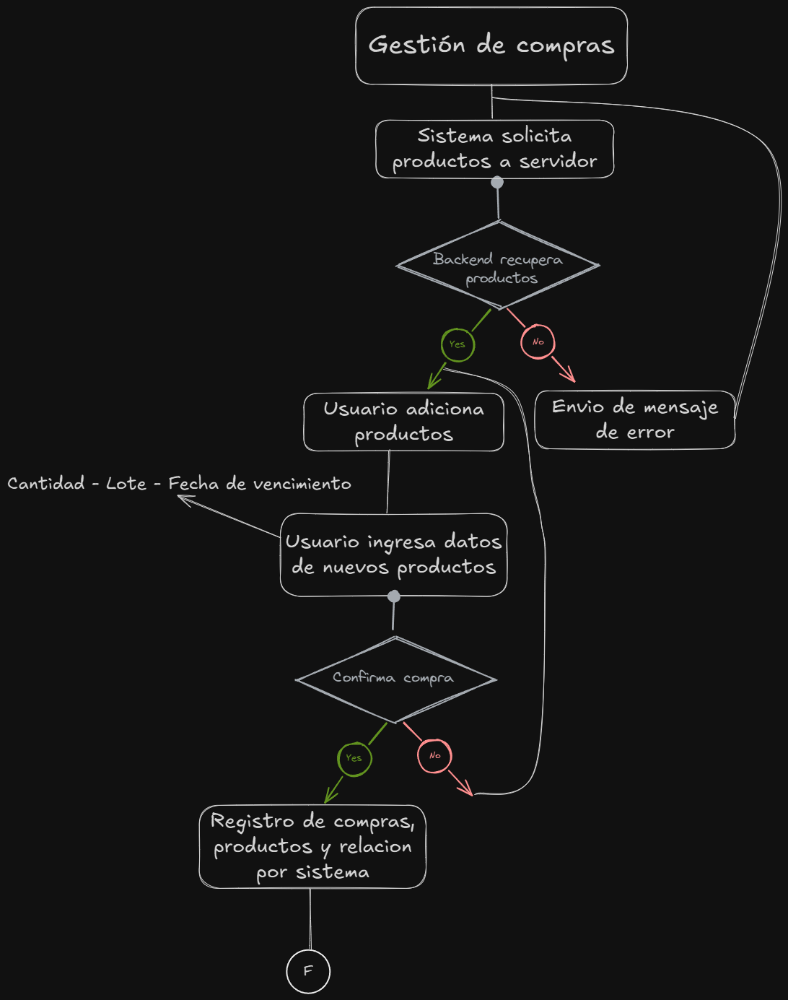

## RF-07.1 Registro de Compras (Altas de productos)

### Historia de Usuario

**_Como_** usuario del sistema
**_Quiero_** tener un registro para nuevas compras donde establecer la fecha de pedido, la fecha esperada de recepcion.
Ademas de tener la posiblidad de seleccionar varios tipos de producto para ordenar, pudiendo escoger si quiero comprar por cajas o por unidades. Recibo varios productos que pueden tener o no el mismo numero de lote asi que quiero poder adjuntar diferentes lotes para mi producto o crear nuevos en caso de ser necesario,6 y a su vez adjutar las fechas de vencimiento para cada lote de productos.
Finalmente quiero agregar el precio al cual estoy comprando estos productos el cual sera una media ponderada entre el precio viejo y el precio nuevo
**_Para_** gestionar las compras de productos y mantener un inventario actualizado.

### Requerimientos no funcionales

| **RNF-07.2** | RF-07.2 | Pagina principal con tabla de historial de ventas realizadas | Operaciones | Alta |
| **RNF-07.3** | RF-07.2 | Formulario de registro de ventas con productos en cards | Operaciones | Alta |
| **RNF-07.4** | RF-07.2 | Registro de ventas en base de datos | Operaciones | Alta |
| **RNF-07.5** | RF-07.2 | Generación de PDF con detalle de ventas | Operaciones | Alta |

### Tareas

#### Shared

[] Crear modelo DTO para recuperar productos del inventario local, datos de id, nombre, nombre clínico, ruta_imagen, precio por unidad, precio por caja y stock disponible.
[] Crear modelo DTO para registrar venta, datos de id

#### Frontend

#### Backend

### Criterios de Aceptacion

### Dependencias

### Caso de Uso

**Escenario**:
**Resultado esperado**:

### Mockups

### Flujo de Datos

